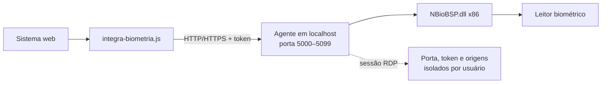

<div align="center">

# 🖐️ Agente de Biometria Remota

**Integração segura entre sistemas web e leitores biométricos NITGEN em ambientes Windows e RDP.**


</div>

---

## Sobre o projeto

O Agente de Biometria Remota conecta uma aplicação web ao leitor biométrico instalado na máquina do usuário. Ele roda na bandeja do Windows, expõe uma API somente em `localhost` e usa o SDK NBioBSP para capturar, cadastrar e comparar digitais.

O agente foi pensado especialmente para servidores Windows com múltiplas sessões RDP: cada usuário possui sua própria instância, porta, token e lista de sites autorizados.

### Principais recursos

- Captura de digital para verificação.
- Cadastro biométrico por meio do modo de enrollment do SDK.
- Comparação 1:1 entre dois templates.
- Identificação 1:N com até 5.000 candidatos por chamada.
- Descoberta automática do agente entre as portas `5000` e `5099`.
- Isolamento entre sessões RDP.
- Autorização explícita de origens web pela bandeja.
- Token aleatório por execução e comunicação restrita ao loopback.
- HTTP e HTTPS na mesma porta local.
- Supervisor integrado para reiniciar o processo após falhas.
- Instalação centralizada para todos os usuários do servidor.

## Arquitetura



O sistema web é responsável por armazenar os templates biométricos. O agente apenas captura, compara e devolve os resultados; ele não mantém uma base local de digitais.

## Requisitos

- Windows com arquitetura x64 ou x86, executando o agente compilado para `windows/386`.
- Leitor biométrico compatível com NITGEN/NBioBSP.
- Driver e `NBioBSP.dll` x86 instalados.
- Go 1.26 para compilação.
- Python 3 somente para embutir o ícone no executável.
- Privilégios de administrador para a instalação no servidor.

> [!IMPORTANT]
> O agente precisa ser compilado como x86 porque a DLL do SDK utilizada pelo projeto é 32 bits.

## Compilação

No PowerShell:

```powershell
$env:GOOS = "windows"
$env:GOARCH = "386"

go build -trimpath `
  -ldflags="-H windowsgui -s -w -X main.versao=dev -X main.commit=local" `
  -o AgenteBiometria.exe .

python .\embutir-icone.py .\AgenteBiometria.exe .\app.ico
```

O ícone deve ser embutido depois do `go build`. Caso o executável seja assinado com Authenticode, a assinatura deve ser aplicada por último.

## Instalação no servidor

Coloque o executável compilado ao lado de `instalar-servidor.ps1` e execute como administrador:

```powershell
Copy-Item .\AgenteBiometria.exe .\instalador\AgenteBiometria.exe

powershell -ExecutionPolicy Bypass `
  -File .\instalador\instalar-servidor.ps1 `
  -SistemaUrl "https://sistema.exemplo.com" `
  -CorsOrigem "https://sistema.exemplo.com"
```

O instalador:

1. valida se o executável é Windows x86;
2. exige uma assinatura Authenticode válida em produção;
3. instala uma versão identificada pelo hash em `Program Files (x86)`;
4. registra o início automático em `HKLM`;
5. inicia a versão nova na sessão atual;
6. atualiza as demais sessões no próximo logon.

Para laboratório, um binário não assinado pode ser instalado explicitamente com `-PermitirNaoAssinado`.

### Desinstalação

```powershell
powershell -ExecutionPolicy Bypass `
  -File .\instalador\instalar-servidor.ps1 `
  -Desinstalar
```

Os dados e certificados de cada usuário são preservados durante a desinstalação.

## Integração com uma aplicação web

Copie [`integracao/integra-biometria.js`](integracao/integra-biometria.js) para os arquivos públicos do seu sistema:

```html
<script src="/assets/integra-biometria.js"></script>
```

Antes da primeira operação, descubra e autorize o agente:

```js
const conectado = await Biometria.garantirConexao()

if (!conectado) {
  throw new Error('Agente de biometria não encontrado ou não autorizado.')
}
```

Na primeira conexão de um site ainda desconhecido, o usuário deve abrir o ícone do agente na bandeja e selecionar **Autorizar acesso**. Em versões atuais do Chrome, o navegador também pode solicitar permissão para acessar a rede local.

### Cadastrar uma digital

```js
const template = await Biometria.enroll()

await fetch('/api/beneficiarios/123/biometria', {
  method: 'POST',
  headers: { 'Content-Type': 'application/json' },
  body: JSON.stringify({ template }),
})
```

### Verificar uma digital — 1:1

```js
const templateLido = await Biometria.capturar()
const confere = await Biometria.comparar(templateCadastrado, templateLido)

console.log(confere ? 'Digital confirmada' : 'Digital não confere')
```

### Identificar entre vários cadastros — 1:N

```js
const templateLido = await Biometria.capturar()
const candidatos = registros.map((item) => ({
  id: String(item.id),
  template: item.template,
}))

const resultado = await Biometria.identificar(templateLido, candidatos)

if (resultado.confere) {
  console.log('Cadastro identificado:', resultado.id)
}
```

Os IDs precisam ser strings únicas e não vazias. Cada chamada aceita entre 1 e 5.000 candidatos.

## API local

| Método | Rota | Descrição |
|---|---|---|
| `GET` | `/api/hello` | Descobre o agente e inicia a autorização da origem. |
| `GET` | `/api/ping` | Confirma que a API está respondendo. |
| `GET` | `/api/status` | Informa versão, DLL e quantidade de leitores. |
| `POST` | `/api/public/v1/captura/Capturar` | Captura um template para verificação. |
| `POST` | `/api/public/v1/captura/Enroll` | Captura um template de cadastro. |
| `POST` | `/api/public/v1/captura` | Compara dois templates. |
| `POST` | `/api/public/v1/identificar` | Procura uma leitura entre vários candidatos. |

Com exceção de `/api/hello`, as rotas exigem o token da sessão no cabeçalho `X-Bio-Token`.

## Configuração

| Variável | Finalidade |
|---|---|
| `SISTEMA_URL` | URL aberta pelo menu **Abrir sistema** e origem autorizada automaticamente. |
| `CORS_ORIGEM` | Lista de origens exatas previamente autorizadas, separadas por vírgula ou ponto e vírgula. |
| `PORTA` | Fixa uma porta em vez de usar a descoberta entre `5000–5099`. |
| `NBIOBSP_DLL` | Define manualmente o caminho da `NBioBSP.dll`. |

O curinga `*` não é aceito em `CORS_ORIGEM`.

## Segurança

- O listener abre exclusivamente em `127.0.0.1`.
- A descoberta valida se navegador e agente pertencem à mesma sessão Windows.
- Cada execução recebe um token aleatório de 256 bits.
- As origens CORS precisam ser exatas e previamente autorizadas.
- O token é mantido em `sessionStorage`; a porta fica em `localStorage`.
- Certificado, chave e autorizações ficam separados por usuário em `%LOCALAPPDATA%\BiometriaAgente`.
- As respostas da API não são armazenadas em cache.

> [!CAUTION]
> Templates biométricos são dados sensíveis. Armazene-os no backend com controle de acesso, criptografia e políticas compatíveis com a LGPD. Nunca coloque templates diretamente em HTML, URLs ou logs.

## Estrutura do projeto

```text
.
├── main.go                 # API HTTP, tray e ciclo de vida
├── sdk.go                  # Integração com NBioBSP.dll
├── worker.go               # Processo isolado que hospeda o SDK
├── autoteste.go            # Comandos de diagnóstico
├── versaodll.go            # Versão da DLL e módulos carregados
├── log.go                  # Registro em arquivo
├── session.go              # Isolamento entre sessões Windows/RDP
├── origins.go              # Autorização e persistência de origens
├── cert.go                 # Certificado local e listener HTTP/HTTPS
├── supervisor.go           # Reinício automático do processo filho
├── storage.go              # Escrita atômica de dados locais
├── docs/
│   └── diagnostico-verifymatch-rdp-2026-07-30.md
├── instalador/
│   └── instalar-servidor.ps1
├── integracao/
│   ├── integra-biometria.js
│   └── COMO-USAR.md
├── app.ico
├── tray-verde.ico
└── tray-vermelho.ico
```

## Diagnóstico

O executável aceita comandos que rodam fora do modo normal. Feche o agente antes
de usá-los: dois processos disputando o mesmo leitor derrubam a captura.

| Comando | O que faz | Precisa de leitor? |
|---|---|---|
| `--autoteste` | Exercita o caminho completo: captura, comparação direta e pelo worker. Grava relatório em `%LOCALAPPDATA%\BiometriaAgente\autoteste.log`. | Sim, 3 leituras |
| `--salvar-template <arquivo>` | Captura uma digital e grava o template em arquivo. | Sim |
| `--conferir-template <arquivo>` | Compara um template com ele mesmo. | **Não** |
| `--gerar-cert` | Regenera o certificado local. | Não |

Códigos de saída: `0` passou, `1` o SDK recusou com erro tratado, `2` a DLL
derrubou o processo — nesse caso o traceback traz o endereço da falha, que se
compara com as faixas dos módulos listados logo antes.

Os dois comandos de template juntos separam **extrator** de **comparador**:
leve um template de uma máquina que funciona para a que falha. Se ele passar lá,
o comparador está bom e o defeito é da captura; se falhar, é o comparador. Sem
isso os dois sempre falham juntos e nada se distingue.

Toda execução registra qual `NBioBSP.dll` foi aberta, com versão e tamanho, e a
lista dos módulos nativos carregados no processo. Templates nunca aparecem nos
logs — só tamanho e um `sha256` curto.

## Solução de problemas

| Sintoma | Verificação |
|---|---|
| Agente não encontrado | Confirme que o processo está rodando na mesma sessão RDP. |
| Origem não autorizada | Abra o tray e aprove o endereço exibido em **Autorizar acesso**. |
| Nenhum leitor detectado | Confira cabo, driver, redirecionamento RDP e arquitetura da DLL. |
| `NBioBSP.dll nao encontrada` | Instale o SDK x86 ou configure `NBIOBSP_DLL`. |
| `Template adulterado` (`0x000B`) ou queda no `VerifyMatch` | Rode `--conferir-template` com um template sabidamente válido. Se a lista de módulos trouxer `ftapihook32.dll` ou `ftfpstub.dll`, veja [docs/diagnostico-verifymatch-rdp-2026-07-30.md](docs/diagnostico-verifymatch-rdp-2026-07-30.md). |
| Token expirado | Execute novamente `Biometria.garantirConexao()`. |
| Navegador bloqueou localhost | Use o sistema em HTTPS e conceda a permissão de rede local. |

## Licença

Copyright © 2026 Leonardo de Oliveira.

Distribuído sob a licença Apache 2.0. Consulte o arquivo [`LICENSE`](LICENSE) para conhecer os termos.

---

<div align="center">

Feito em Go para manter a integração biométrica local, simples e isolada por sessão.

</div>
